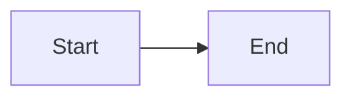

# Convert Markdown with mashay

mashay converts Markdown into self-contained, styled HTML files. It has two halves: invoking the CLI, and writing Markdown the CLI's pipeline understands.

## Invoking the CLI

Package `@draekien/mashay` (published public on npm), binary name `mashay`. Conversion is the `process` subcommand. Run it via `npx @draekien/mashay process [src] [--out <dir>] [--template <name>] [--theme <name>]`, or install it (globally or as a project dev dependency) and invoke `mashay process` directly. Bare `mashay` with no subcommand prints help.

`mashay --version` prints the CLI version — useful for checking which release `npx` resolved.

`[src]` is a single `.md` file or a directory of `.md` files — direct mode reads only that directory's top level, not subdirectories. `--out` defaults to `out` relative to the current working directory.

Run `mashay process` with no `[src]` to get interactive mode: it recursively scans the current directory for `.md` files (skipping `node_modules`, `.git`, `dist`, `out`, and any dotfiles/dot-directories), groups them by folder, and prompts for a multi-select and an output directory.

`--template <name>` chooses the HTML skeleton + its styling (default `academic`), `--theme <name>` chooses the colour palette (defaults to the template name). A template is `templates/<name>/template.html` plus a colocated `templates/<name>/template.css` (component styling, non-colour tokens, and prose mappings); a theme is `themes/<name>/theme.css` containing **colour tokens only** — a standardized `--color-*` set every template shares, so any theme pairs with any template. One of each ships (`academic`) and they pair by default, but you can mix and match. An unknown template or theme name errors with the list of available names. At build time Tailwind v4 + `@tailwindcss/typography` compile only the used CSS and inline it into a single `<style>`.

Run `mashay docs` for an interactive browser of every formatting rule and supported syntax topic (frontmatter, headings, alerts, mermaid, appendix, code blocks, and each Obsidian syntax feature) — or `mashay docs <topic>` (e.g. `mashay docs alerts`) to print one topic directly without prompts. The rules below are the same content this command serves; treat that command as the fluent/interactive way to explore them and this document as the reference to keep in sync (`src/lib/formatting-docs.ts` is the source of truth the command reads from).

Each `<file>.md` becomes `<file>.html` in the output directory. The HTML is fully self-contained (styles, and any configured logo, inlined) — with one exception: a document containing a Mermaid diagram needs internet access at *view* time, since the Mermaid renderer loads from a CDN rather than being inlined into every file.

## Authoring a Markdown file mashay can convert

[examples/example.md](../../../examples/example.md) is a complete working example — a neutral "A Field Guide to Coffee Brewing" sample exercising every feature — and [examples/example-obsidian.md](../../../examples/example-obsidian.md) covers the Obsidian syntax. Read them alongside the rules below rather than inferring syntax from scratch. [assets/example.md](assets/example.md) mirrors the main example for skills installed standalone.

### Frontmatter

```yaml
---
title: A Field Guide to Coffee Brewing
description: How grind size, water, and time shape a cup.
author: Jane Researcher
logo: logo.svg
date: 2026-07-13
status: Draft
version: "1.1"
reviewers:
  - Jane Doe
  - John Smith
classification: Public
changelog:
  - version: "1.1"
    date: 2026-07-13
    description: Initial release.
---
```

Every field is optional, and unrecognized extra fields pass through without error — but a field of the wrong shape (e.g. a non-string `title`, or `reviewers` given as a single string instead of a list) fails the build. Omit `title` and the output's `<title>` falls back to the source filename.

`status` renders as a small eyebrow/badge above the document title; omit it and no eyebrow renders at all. `version`, `date`, `author`, `reviewers` (comma-joined), and `classification` render as a meta grid below the subtitle, each only appearing when its field is present — the grid itself is omitted entirely when none of the five are set.

`logo` is an optional path to an image (SVG, or a raster format such as PNG/JPEG), resolved relative to the Markdown source file. It is inlined into the masthead logo slot — SVGs embedded as-is, raster images as a base64 `data:` URI, keeping the output self-contained. Omit it and the masthead renders with no logo. There is no bundled default logo.

`changelog` is optional. When present, it is a list of `{ version, date, description }` entries (`date` and `description` are optional; `version` is required) — each one becomes a row in a "Revision History" disclosure rendered collapsed at the top of the content column, in the order given. Omit it entirely and no revision history renders.

### Headings and numbering

- `#` is reserved for the auto-generated document title — start body sections at `##`.
- Headings are auto-numbered (`1`, `1.1`, `1.1.1`), resetting deeper counters whenever a shallower heading appears.
- In the main body, the sidebar TOC only lists `##` and `###` levels; `####` is still numbered but omitted from the TOC — reserve `####` for detail that doesn't need direct navigation. Headings under the Appendix follow a different rule — see below.
- Anchor links use the heading text slugified (lowercased, hyphenated), ignoring the generated number — link with standard Markdown, e.g. `[see Introduction](#introduction)`.

### Alert blockquotes

GitHub-style alert blockquotes:

```markdown
> [!NOTE]
> Some contextual detail.
```

- Markers group into four visual styles following Obsidian's callout semantics (`important`/`hint` are aliases of `tip`; `caution`/`attention` are aliases of `warning` — only genuinely negative types render as errors). The five GitHub markers map as: `[!NOTE]`, `[!TIP]`, and `[!IMPORTANT]` → info; `[!WARNING]` and `[!CAUTION]` → warn.
- Obsidian's broader callout vocabulary is also recognized (case-insensitively) — `[!ABSTRACT]`/`[!SUMMARY]`/`[!TLDR]`/`[!INFO]`/`[!TODO]`/`[!HINT]`/`[!EXAMPLE]`/`[!QUOTE]`/`[!CITE]` → info; `[!SUCCESS]`/`[!CHECK]`/`[!DONE]` → success; `[!QUESTION]`/`[!HELP]`/`[!FAQ]`/`[!ATTENTION]` → warn; `[!DANGER]`/`[!ERROR]`/`[!FAILURE]`/`[!FAIL]`/`[!MISSING]`/`[!BUG]` → error. Obsidian's optional trailing fold indicator (`[!TIP]+` or `[!TIP]-` for a collapsible callout) is accepted but ignored — the alert box is never collapsible.
- The marker must be the first line of the blockquote. Text placed on the same line as the marker (`> [!NOTE] inline detail`) becomes a separate paragraph below the alert title, same as text on the following lines.
- A blockquote with no recognized marker (GitHub's five or Obsidian's aliases) renders as an ordinary `<blockquote>` — no special styling.

### Mermaid diagrams

````markdown

````

Diagrams render client-side and are click-to-zoom (opens a lightbox on click). The Mermaid renderer script is only inlined into files that actually contain a mermaid code block.

### Appendix section

A `## Appendix` heading (matched case-insensitively on its text, ignoring any number prefix) switches every following `###` into its own lettered numbering (`A`, `B`, `C`, ...) and every following `####` into a sub-level under that letter (`A.1`, `A.2`, ...), gives them a separate "Appendix" group in the TOC, and wraps each `###` (and its content) in a collapsible `<details>` element using the heading as the `<summary>`. Unlike the main body, both `###` and `####` appear in the Appendix TOC — the two-level cap doesn't hide the deeper one here.

- Put `## Appendix` last. Appendix lettering never reverts to normal numbering, even after another `##` heading — a `##` placed after the appendix gets no number and is dropped from every TOC, while its own `###`/`####` children keep advancing the appendix letter sequence and still show up in the Appendix TOC, just without the `<details>` wrapping the rest of the appendix gets. Avoid this structure entirely; treat the appendix as the document's final section.
- Only `###` headings under the appendix become collapsible entries; other content placed directly under `## Appendix`, before its first `###`, sits outside any `<details>` wrapper.

### Code blocks

A fenced code block with a language tag renders in a bordered `.code-block` with a header showing the language, syntax-highlighted at build time (highlight.js common languages — the output stays self-contained; an unrecognized language renders unhighlighted):

````markdown
```ts
const x = 1;
```
````

Add a meta word after the language to show it as a filename in the header:

````markdown
```ts app.ts
const x = 1;
```
````

A fence with no language tag renders as a plain `<pre><code>` with no header. Mermaid fences (see above) are handled separately and never get this wrapping.

### Obsidian vault syntax

mashay is often run directly against a Markdown file exported from (or still living in) an Obsidian vault. There is no vault-wide concept of what other notes will ever be published as HTML, so anything that would normally link to another note instead renders as plain text — nothing 404s.

- **Wikilinks** — `[[Note]]`, `[[Note|Alias]]`, `[[Note#Heading]]`, `[[Note#Heading|Alias]]` all render as plain text: the alias if given, else `Note › Heading`, else just the bare target or heading. They are never turned into `<a>` links.
- **Image embeds** — `![[image.png]]` resolves the file relative to the source Markdown file (searching downward through subdirectories, then upward through ancestor directories and their `attachments` folders — common vault layouts), then inlines it as a base64 `data:` URI, matching mashay's self-contained-output philosophy. `![[image.png|300]]` sets a pixel width; `![[image.png|alt text]]` (non-numeric) sets alt text instead. An embed that can't be resolved to a file, or resolves to a non-image file, falls back to plain text (the alt/target name) rather than leaving raw `![[...]]` markup in the output.
- **Highlights** — `==text==` renders as `<mark>text</mark>`.
- **Comments** — `%%text%%` is stripped entirely. Only matches within a single paragraph/line — a comment spanning a blank line is not stripped.
- **Block references** — a trailing `^block-id` at the very end of a block is stripped (the anchor has no meaning outside the vault); a caret elsewhere in the text (e.g. `2^10`) is left alone.
- **Wikilinks inside GFM tables** — a bare `[[Note]]` works in a table cell with no changes needed. An **aliased** wikilink's `|` collides with the table's own column separator, since GFM tokenizes table cells before any wikilink parsing runs — escape it as `[[Note\|Alias]]` (backslash before the pipe) so the cell parses correctly; `[[Note#Heading|Alias]]` needs the same escape.

### Formatting constraints

- Tables, strikethrough, autolinks, and task lists (GitHub-flavored Markdown) are all supported.
- Raw HTML embedded in the Markdown is rendered through — both inline (e.g. `<span>`) and block-level elements pass into the output.
