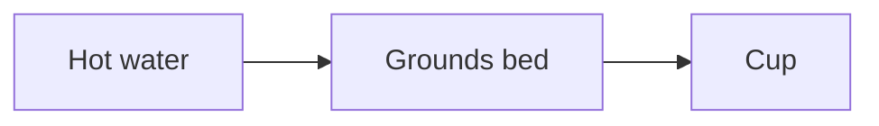

# mashay

Converts Markdown into self-contained, styled HTML documents — a single file
with all styles (and any logo) inlined, ready to share or email.

## Usage

Run it from anywhere without installing anything permanently:

```bash
npx @draekien/mashay process [src] [--out <dir>] [--template <name>] [--theme <name>]
```

Conversion is the `process` subcommand. `[src]` is a single `.md` file or a
directory of `.md` files; give it and mashay builds directly. Omit it and mashay
drops into an interactive multi-select file picker. Running bare `mashay` with
no subcommand prints help.

```bash
npx @draekien/mashay process ./my-doc.md
npx @draekien/mashay process ./docs --out ./html
```

With no source path, mashay recursively scans the current directory for `.md`
files, groups them by folder, and lets you multi-select which ones to build and
set the output directory:

```bash
npx @draekien/mashay process
```

Each `<file>.md` becomes `<file>.html` in the output directory. `--out`
defaults to `out` in the current directory.

`--version` prints the CLI version, useful for checking which release `npx`
resolved:

```bash
npx @draekien/mashay --version
```

`mashay docs [topic]` prints the Markdown formatting rules documented below
(frontmatter, headings, alerts, code blocks, mermaid, appendix, Obsidian
syntax) — omit `[topic]` for an interactive browser, or pass a topic id
(e.g. `mashay docs alerts`) to print one directly:

```bash
npx @draekien/mashay docs
npx @draekien/mashay docs alerts
```

Each HTML output is a single self-contained document (styles and logo inlined)
that can be shared or emailed directly, with one exception: see
**Mermaid diagrams** below.

### Installing

If you'll be converting documents regularly, install the CLI instead of using
`npx` on every run:

```bash
pnpm add -D @draekien/mashay
# or globally: pnpm add -g @draekien/mashay
# or with npm: npm install -g @draekien/mashay
```

Then invoke it directly:

```bash
mashay process [src] [--out <dir>] [--template <name>] [--theme <name>]
mashay process
```

## Templates and themes

mashay separates *layout* from *styling*:

- **Templates** are `templates/<name>/template.html` (an HTML skeleton whose
  chrome and layout are authored with Tailwind utility classes referencing
  `var(--color-*)` tokens) plus a colocated `templates/<name>/template.css` — the
  non-colour design tokens (fonts, spacing, radii, transitions, z-index), the
  component/structural CSS, and the typography plugin's `--tw-prose-*` mappings.
- **Themes** are `themes/<name>/theme.css` files containing **colour tokens
  only** — a standardized `--color-*` set that every template is written
  against. Swapping the theme swaps the palette; because the token names are
  shared, any theme pairs with any template.

Select them with `--template <name>` (default `academic`) and `--theme <name>`
(defaults to the template's name). One template and one theme ship today, both
named `academic`; they pair by default, but you can mix and match:

```bash
mashay process ./my-doc.md --template academic --theme academic
```

Unknown template or theme names error with the list of available names. The
architecture is built so more templates and themes can be added later.

At build time, Tailwind v4 and `@tailwindcss/typography` compile only the CSS
the page actually uses, and it's inlined into a single `<style>` block — so the
output is one self-contained `.html` file. The only exception: a document
containing a Mermaid diagram still loads Mermaid's renderer from a CDN at view
time.

> _Coming later: a `--style` preview command for browsing template/theme
> combinations._

## Markdown conventions

### Frontmatter

```markdown
---
title: A Field Guide to Coffee Brewing
description: How grind size, water, and time shape a cup.
author: Jane Researcher
logo: logo.svg
date: 2026-07-13
status: Draft
version: "1.1"
reviewers:
  - Jane Doe
  - John Smith
classification: Public
changelog:
  - version: "1.1"
    date: 2026-07-13
    description: Added the extraction timing script.
  - version: "1.0"
    date: 2026-06-01
    description: Initial release.
---
```

Nothing is required — every field is optional, and unrecognized extra fields
pass through without error. A field of the wrong shape (e.g. a non-string
`title`, or `reviewers` given as a single string instead of a list) fails the
build. Omit `title` and the output's `<title>` falls back to the source
filename.

- `status` renders as an eyebrow/badge above the title; when absent, no eyebrow
  renders.
- `version`, `date`, `author`, `reviewers` (comma-joined), and `classification`
  render as a meta grid, each appearing only when set — the grid is omitted
  entirely when none are present.
- `logo` is an optional path to an image (SVG or a raster format such as
  PNG/JPEG), resolved relative to the Markdown source file and inlined into the
  masthead — SVGs embedded as-is, raster images as a base64 `data:` URI. Omit it
  and the masthead renders with no logo. There is no bundled default.
- `changelog` is optional; when present it renders as a collapsed "Revision
  History" disclosure at the top of the content column. It's a list of
  `{ version, date, description }` entries (`date` and `description` optional,
  `version` required).

### Headings and table of contents

`##` and `###` (and `####`) headings are automatically numbered (`1`, `1.1`,
`1.1.1`, ...). The sticky table of contents shows only the first two levels
(`##` and `###`) to avoid excessive nesting — `####` headings are still numbered
in the body but don't appear in the TOC. Link between sections with standard
Markdown anchor links, e.g. `[see Introduction](#introduction)` — anchors are
slugified from the heading text, ignoring the generated numbering.

### Alert blockquotes

GitHub-style alert blockquotes are supported and rendered as styled callouts:

```markdown
> [!NOTE]
> Some contextual detail.

> [!WARNING]
> Something the reader must not overlook.

> [!IMPORTANT]
> A correctness requirement.
```

`[!NOTE]` / `[!TIP]` / `[!IMPORTANT]` render as **info** and `[!WARNING]` /
`[!CAUTION]` as **warn**, following Obsidian's callout semantics (`important`
is an alias of `tip`, `caution` of `warning`). Obsidian-only types add two more
styles: `[!SUCCESS]` renders as **success** and `[!DANGER]` / `[!ERROR]` /
`[!FAILURE]` / `[!BUG]` as **error** — four visual styles total.

### Code blocks

Fenced code blocks with a language tag render in a bordered block with a
language header and are syntax-highlighted at build time (highlight.js common
languages), so the output stays self-contained. A meta word after the language
(e.g. ` ```ts app.ts `) shows as a filename in the header.

### Mermaid diagrams

````markdown

````

Diagrams render in place and are click-to-zoom (a lightbox opens on click). The
Mermaid renderer is loaded from a CDN (jsDelivr) and **only** included in files
that actually contain a `mermaid` code block — so documents without diagrams
stay fully self-contained, while documents with diagrams need internet access
to render them.

### Appendix

A `## Appendix` heading switches subsequent `###` subsections into their own
lettered numbering scheme (`A`, `B`, `C`, ...) and a separate TOC group, with
each entry rendered as a collapsible `<details>` block:

```markdown
## Appendix

### Methodology

...

### Glossary

...
```

### Obsidian syntax

mashay understands Obsidian-vault syntax — wikilinks, image embeds, callouts,
highlights (`==text==`), comments (`%%text%%`), and block references — so a note
exported from (or still living in) a vault converts cleanly. See
`mashay docs` or `examples/example-obsidian.md` for the full set.

## Project layout

```
templates/
  academic/    template.html (Tailwind chrome) + template.css (components, non-colour tokens, prose)
themes/
  academic/    theme.css — colour tokens only (standardized --color-* set)
examples/
  example.md           Neutral sample exercising every feature
  example-obsidian.md  Obsidian-vault syntax sample
src/
  cli.ts    CLI entry point (bin: mashay)
  lib/      Build pipeline: markdown/rehype plugins, TOC rendering,
            frontmatter validation, file discovery, template/theme
            resolution, and Tailwind compilation (build.ts)
out/        Generated HTML output (gitignored)
dist/
  cli.js    Bundled output (rolldown; gitignored)
```

## Working in this repo

```bash
pnpm install
pnpm run build            # typecheck + rolldown bundle to dist/cli.js
pnpm run build:examples   # build the CLI, then convert examples/ → out/
pnpm test                 # build, then run the vitest suite
pnpm run dev              # local dev runner (scripts/dev.mjs)
```

## Publishing

```bash
pnpm run release
git push --follow-tags origin main
pnpm publish
```

`pnpm run release` runs `commit-and-tag-version`, which inspects commits since
the last tag, bumps the version in `package.json` according to
conventional-commit rules (`fix` → patch, `feat` → minor, `BREAKING CHANGE` →
major), writes `CHANGELOG.md`, then creates a `chore(release): x.y.z` commit and
git tag — it does not push or publish.

`dist/` is never committed to git, so the `prepublishOnly` script runs
`pnpm run build` automatically before `pnpm publish`. The published package
contains `dist`, `templates`, and `themes`.

## Claude Code skill

Agents using [Claude Code](https://claude.com/claude-code) can install the
`using-mashay` skill straight from this repo:

```bash
npx skills add draekien/mashay
```

This installs `.claude/skills/using-mashay/SKILL.md`, which explains how to
invoke the CLI and how to author Markdown its pipeline understands — the same
conventions documented above.

## License

MIT
