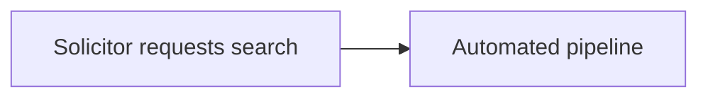

# mashay

Converts Markdown whitepapers into self-contained, styled HTML files — a single
document with all styles (and any logo) inlined, ready to share or email.

## Usage

Run it from anywhere without installing anything permanently:

```bash
npx mashay whitepaper <src-file-or-dir> [--out <dir>]
```

The `whitepaper` subcommand builds whitepapers (bare `mashay` prints the
command list — document types each get their own subcommand so more can be
added later). `<src-file-or-dir>` can be a single `.md` file or a directory
of `.md` files. `--out` defaults to `./out` in the current directory.

```bash
npx mashay whitepaper ./my-whitepaper.md
npx mashay whitepaper ./whitepapers/src --out ./html
```

Omit the source path to pick files interactively — it recursively scans the
current directory for `.md` files, groups them by folder, and lets you
multi-select which ones to build and set the output directory:

```bash
npx mashay whitepaper
```

`--version` prints the CLI version, useful for checking which release `npx`
resolved:

```bash
npx mashay --version
```

`mashay docs [topic]` prints the Markdown formatting rules documented below
(frontmatter, headings, alerts, code blocks, mermaid, appendix) — omit
`[topic]` for an interactive browser, or pass a topic id (e.g. `mashay docs
alerts`) to print one directly:

```bash
npx mashay docs
npx mashay docs alerts
```

Each HTML output is a single self-contained document (styles and logo
inlined) that can be shared or emailed directly, with one exception: see
**Mermaid diagrams** below.

### Installing globally

If you'll be building whitepapers regularly, install the CLI once instead of
using `npx` on every run:

```bash
pnpm add -g mashay
# or: npm install -g mashay
```

Then invoke it directly:

```bash
mashay whitepaper <src-file-or-dir> [--out <dir>]
mashay whitepaper
```

### Working in this repo

```bash
pnpm install
pnpm run build:whitepapers
```

builds `whitepapers/src/` into `whitepapers/dist/` using the same CLI
(`src/cli.ts`, bundled to `dist/cli.js`).

### Publishing

```bash
pnpm run release
git push --follow-tags origin main
pnpm publish
```

`pnpm run release` runs `commit-and-tag-version`, which inspects commits
since the last tag, bumps the version in `package.json` according to
conventional-commit rules (`fix` → patch, `feat` → minor, `BREAKING CHANGE`
→ major), and writes `CHANGELOG.md`, then creates a `chore(release): x.y.z`
commit and git tag — it does not push or publish.

`dist/` is never committed to git, so the `prepublishOnly` script runs
`pnpm run build` automatically before `pnpm publish`.

## Claude Code skill

Agents using [Claude Code](https://claude.com/claude-code) can install the
`using-mashay` skill straight from this repo:

```bash
npx skills add draekien/mashay
```

This installs `.claude/skills/using-mashay/SKILL.md`, which explains how
to invoke the CLI and how to author compliant whitepaper Markdown (frontmatter,
heading numbering, alert blockquotes, Mermaid diagrams, and the Appendix
section) — the same conventions documented below.

## Markdown conventions

### Frontmatter

```markdown
---
title: Streamlining Property Due Diligence
description: How automation reduces settlement risk for conveyancers.
author: Jane Researcher
logo: logo.svg
date: 2026-07-13
changelog:
  - version: "1.0"
    date: 2026-07-13
    description: Initial version.
---
```

`changelog` is required: every whitepaper carries a revision history with at
least one entry recording the initial version (a file without one fails the
build). It renders as a collapsed "Revision History" disclosure at the top of
the content column. All other fields are optional.

`logo` is an optional path to an image (SVG or a raster format such as
PNG/JPEG), resolved relative to the Markdown source file and inlined into the
masthead — SVGs embedded as-is, raster images as a base64 `data:` URI. Omit it
and the masthead renders with no logo.

### Headings and table of contents

`##` and `###` (and `####`) headings are automatically numbered (`1`, `1.1`,
`1.1.1`, ...). The sticky table of contents on the left shows only the first
two levels (`##` and `###`) to avoid excessive nesting — `####` headings are
still numbered in the body but don't appear in the TOC. Link between sections
with standard Markdown anchor links, e.g. `[see The Problem](#the-problem)` —
anchors are slugified from the heading text, ignoring the generated numbering.

### Alert blockquotes

GitHub-style alert blockquotes are supported and rendered as styled callouts:

```markdown
> [!NOTE]
> Some contextual detail.

> [!WARNING]
> Something the reader must not overlook.

> [!IMPORTANT]
> A compliance or correctness requirement.
```

`[!NOTE]` / `[!TIP]` / `[!IMPORTANT]` render as **info** and `[!WARNING]` /
`[!CAUTION]` as **warn**, following Obsidian's callout semantics (`important`
is an alias of `tip`, `caution` of `warning`). Obsidian-only types add two
more styles: `[!SUCCESS]` renders as **success** and `[!DANGER]` / `[!ERROR]`
/ `[!FAILURE]` / `[!BUG]` as **error** — four visual styles total.

### Code blocks

Fenced code blocks with a language tag render in a bordered block with a
language header and are syntax-highlighted at build time (highlight.js common
languages), so the output stays self-contained. A meta word after the language
(e.g. ` ```ts app.ts `) shows as a filename in the header.

### Mermaid diagrams

````markdown

````

Diagrams render in place and are click-to-zoom (a lightbox opens on click).
The Mermaid renderer is loaded from a CDN (jsDelivr) and **only** included in
files that actually contain a `mermaid` code block — so whitepapers without
diagrams stay fully self-contained, while whitepapers with diagrams need
internet access to render them.

### Appendix

A `## Appendix` heading switches subsequent `###` subsections into their own
lettered numbering scheme (`A`, `B`, `C`, ...) and a separate TOC group, with
each entry rendered as a collapsible `<details>` block:

```markdown
## Appendix

### Methodology

...

### Glossary

...
```

## Project layout

```
whitepapers/
  src/        Markdown source files (input)
  template/   HTML template, CSS, and design tokens
  dist/       Generated HTML output (gitignored)
src/
  cli.ts    CLI entry point (bin: mashay)
  lib/      Build pipeline: markdown/rehype plugins, TOC rendering,
            frontmatter validation, file discovery, and page assembly
dist/
  cli.js      Bundled, minified output (rolldown; gitignored)
```

## Design system

Styling is driven entirely by the design tokens in
`whitepapers/template/assets/tokens.css` — colors, spacing, radii, etc. all
reference the shared token set rather than hardcoded values, so the look can be
retuned in one place. The logo shown in the masthead is per-document and
configured via the `logo` frontmatter field; nothing is bundled by default.

## Future: PDF output

The template and build script are structured so that a Markdown → PDF path
can be added later (e.g. printing the generated HTML with a headless browser)
without changing the Markdown authoring conventions above.
