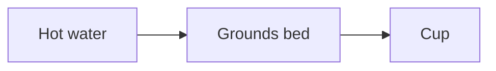

# Markdown conventions

## Frontmatter

```markdown
---
title: A Field Guide to Coffee Brewing
description: How grind size, water, and time shape a cup.
author: Jane Researcher
logo: logo.svg
date: 2026-07-13
status: Draft
version: "1.1"
reviewers:
  - Jane Doe
  - John Smith
classification: Public
changelog:
  - version: "1.1"
    date: 2026-07-13
    description: Added the extraction timing script.
  - version: "1.0"
    date: 2026-06-01
    description: Initial release.
---
```

Nothing is required — every field is optional, and unrecognized extra fields
pass through without error. A field of the wrong shape (e.g. a non-string
`title`, or `reviewers` given as a single string instead of a list) fails the
build. Omit `title` and the output's `<title>` falls back to the source
filename.

- `status` renders as an eyebrow/badge above the title; when absent, no eyebrow
  renders.
- `version`, `date`, `author`, `reviewers` (comma-joined), and `classification`
  render as a meta grid, each appearing only when set — the grid is omitted
  entirely when none are present.
- `logo` is an optional path to an image (SVG or a raster format such as
  PNG/JPEG), resolved relative to the Markdown source file and inlined into the
  masthead — SVGs embedded as-is, raster images as a base64 `data:` URI. Omit it
  and the masthead renders with no logo. There is no bundled default.
- `changelog` is optional; when present it renders as a collapsed "Revision
  History" disclosure at the top of the content column. It's a list of
  `{ version, date, description }` entries (`date` and `description` optional,
  `version` required).

## Headings and table of contents

`##` and `###` (and `####`) headings are automatically numbered (`1`, `1.1`,
`1.1.1`, ...). The sticky table of contents shows only the first two levels
(`##` and `###`) to avoid excessive nesting — `####` headings are still numbered
in the body but don't appear in the TOC. Link between sections with standard
Markdown anchor links, e.g. `[see Introduction](#introduction)` — anchors are
slugified from the heading text, ignoring the generated numbering.

## Alert blockquotes

GitHub-style alert blockquotes are supported and rendered as styled callouts:

```markdown
> [!NOTE]
> Some contextual detail.

> [!WARNING]
> Something the reader must not overlook.

> [!IMPORTANT]
> A correctness requirement.
```

`[!NOTE]` / `[!TIP]` / `[!IMPORTANT]` render as **info** and `[!WARNING]` /
`[!CAUTION]` as **warn**, following Obsidian's callout semantics (`important`
is an alias of `tip`, `caution` of `warning`). Obsidian-only types add two more
styles: `[!SUCCESS]` renders as **success** and `[!DANGER]` / `[!ERROR]` /
`[!FAILURE]` / `[!BUG]` as **error** — four visual styles total.

## Code blocks

Fenced code blocks with a language tag render in a bordered block with a
language header and are syntax-highlighted at build time (highlight.js common
languages), so the output stays self-contained. A meta word after the language
(e.g. ` ```ts app.ts `) shows as a filename in the header.

## Mermaid diagrams

````markdown

````

Diagrams render in place and are click-to-zoom (a lightbox opens on click). The
Mermaid renderer is loaded from a CDN (jsDelivr) and **only** included in files
that actually contain a `mermaid` code block — so documents without diagrams
stay fully self-contained, while documents with diagrams need internet access
to render them.

## Appendix

A `## Appendix` heading switches subsequent `###` subsections into their own
lettered numbering scheme (`A`, `B`, `C`, ...) and a separate TOC group, with
each entry rendered as a collapsible `<details>` block:

```markdown
## Appendix

### Methodology

...

### Glossary

...
```

## Obsidian syntax

mashay understands Obsidian-vault syntax — wikilinks, image embeds, callouts,
highlights (`==text==`), comments (`%%text%%`), and block references — so a note
exported from (or still living in) a vault converts cleanly. See
`mashay docs` or [`examples/example-obsidian.md`](../examples/example-obsidian.md)
for the full set.
